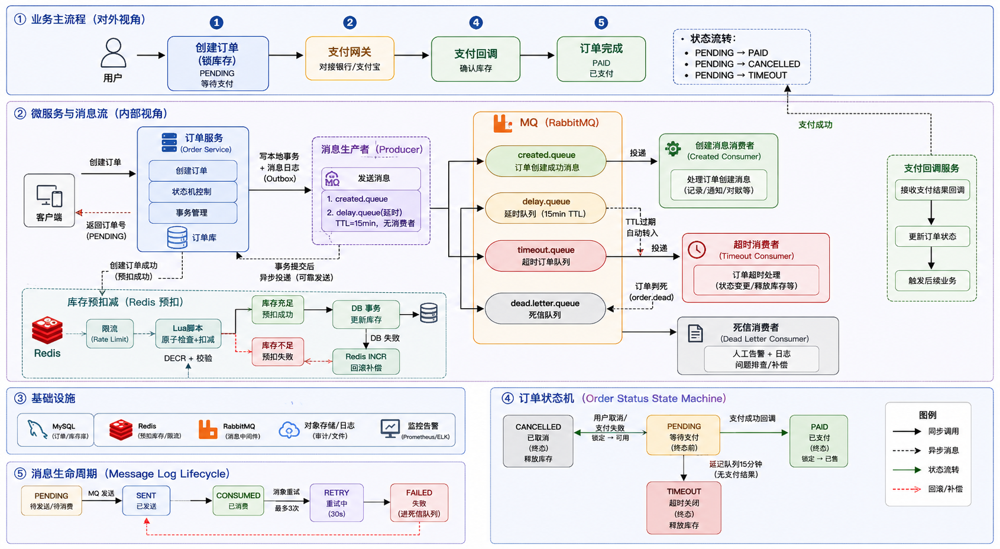

# 订单与库存一致性实验平台

围绕订单创建、库存扣减与支付回调设计的实验型分布式后端系统，重点解决幂等控制、防超卖、缓存与数据库一致性、可靠消息重试、订单超时取消等问题，并结合监控指标与压测分析系统行为。

## 技术栈

- Java 21 + Spring Boot 4
- MyBatis-Plus
- MySQL 8
- Redis 7
- RabbitMQ 3（死信队列、延迟队列）
- Docker Compose
- Micrometer + Prometheus + Grafana
- SpringDoc OpenAPI (Swagger)
- Flyway（数据库版本管理）
- JUnit 并发测试 / 手工压测

## 系统架构

```
┌──────────────────────────────────────────────────────────────┐
│                      Spring Boot 单体应用                      │
│                                                              │
│  ┌──────────┐  ┌───────────┐  ┌──────────┐  ┌────────────┐  │
│  │ Product   │  │ Inventory │  │  Order   │  │  Payment   │  │
│  │ Module    │  │  Module   │  │  Module  │  │  Module    │  │
│  └──────────┘  └───────────┘  └──────────┘  └────────────┘  │
│                                                              │
│  ┌──────────────────┐  ┌─────────────────┐                   │
│  │  Common (Result,  │  │    MQ (Producer, │                   │
│  │  Exception, Rate  │  │    Consumer,     │                   │
│  │  Limit, Idempot)  │  │    Retry Task)   │                   │
│  └──────────────────┘  └─────────────────┘                   │
│                                                              │
│  ┌──────────────────┐  ┌─────────────────┐                   │
│  │  Config (Redis,   │  │   Monitor       │                   │
│  │  RabbitMQ, MBP)   │  │   (Metrics)     │                   │
│  └──────────────────┘  └─────────────────┘                   │
└──────────────────────────────────────────────────────────────┘
         │              │              │
    ┌────┴────┐    ┌────┴────┐    ┌────┴─────┐
    │ MySQL 8 │    │ Redis 7 │    │RabbitMQ 3│
    └─────────┘    └─────────┘    └──────────┘
```

## 核心设计

### 1. 防超卖（两种方案，策略模式切换）

**问题：** 多个用户并发下单同一商品，库存被扣成负数。

**方案一：数据库乐观锁**

```sql
UPDATE inventory
SET available_stock = available_stock - #{quantity},
    locked_stock = locked_stock + #{quantity}
WHERE product_id = #{productId}
  AND available_stock >= #{quantity}
```

将检查和扣减放在同一条 SQL 中，MySQL 行锁保证同一时刻只有一个线程能执行成功，影响行数为 0 则抛出库存不足异常。

**方案二：Redis 预扣 + DB 落库**

下单时先用 Redis `DECR` 原子扣减，结果 < 0 直接拒绝并 `INCR` 回补。扣减成功后再走 DB 事务。大部分"库存不足"的请求在 Redis 层就被拦住，不打数据库。

| 维度 | DB 乐观锁 | Redis 预扣 + DB |
|------|-----------|----------------|
| 防超卖 | 靠 SQL 条件 | 靠 Redis DECR 原子性 |
| DB 压力 | 所有请求都打 DB | 只有预扣成功的打 DB |
| 一致性风险 | 无 | Redis 扣了 DB 失败需回补 |
| 适用场景 | 中低并发 | 高并发秒杀 |

通过 `application.yml` 中 `stock.strategy=db/redis` 切换方案。

### 2. 幂等控制

**问题：** 用户网络抖动或手快连点，导致同一个下单意图创建了多个订单。

**方案：幂等 Token**

1. 前端进入下单页面时请求 `GET /api/orders/token`，获取一个 UUID token（存 Redis，TTL 5 分钟）
2. 提交订单时带上 token
3. 服务端用 Redis `DELETE` 原子删除 token：删成功 = 第一次请求；删失败 = 重复请求
4. 订单表 `idempotent_key` 字段加唯一索引兜底

Redis 做前置拦截保性能，数据库唯一索引做兜底保正确性，两层防御。

### 3. 可靠消息投递（本地消息表 / Outbox 模式）

**问题：** 下单事务提交和 MQ 消息发送是两个独立操作，无法保证原子性。

**方案：**

1. 下单事务中，同时往 `order_message_log` 表插入消息记录（状态 `PENDING`）
2. 事务提交后（`TransactionSynchronization.afterCommit`），发 MQ 消息
3. 发送成功 → 状态更新为 `SENT`
4. 发送失败 → 定时任务每 30 秒扫描 `PENDING` 状态的消息，重试发送
5. 重试超过 3 次 → 标记为 `FAILED`，记录告警日志

消费端通过消息状态做幂等：已经是 `CONSUMED` 的消息直接跳过。

### 4. 订单超时取消（RabbitMQ 延迟队列）

**问题：** 订单创建后 15 分钟未支付需要自动取消并回滚库存。

**方案：TTL + 死信队列**

```
下单 → 消息发到 delay queue（TTL=15min，无消费者）
        → 15 分钟后消息过期，变成死信
        → 转发到 timeout queue
        → OrderTimeoutConsumer 消费：
            PENDING → 改为 TIMEOUT + 回滚库存
            PAID → 跳过（已支付不处理）
```

对比定时扫表方案：扫表有扫描间隔的延迟，延迟队列精度到消息级别。

### 5. 缓存一致性

**问题：** 商品详情缓存在 Redis，更新商品后如何保证缓存和 DB 一致。

**方案：先更新 DB 再删缓存 + 延迟双删 + TTL 兜底**

1. 更新 DB（事务内）
2. 立即删除缓存（第一次删）
3. 500ms 后再删一次缓存（覆盖并发读写竞态）
4. 缓存设 30 分钟 TTL，即使前两步都失败，最终也会一致

### 6. 限流

**问题：** 恶意刷单或突发流量打爆系统。

**方案：Redis 滑动窗口限流**

用 Redis Sorted Set 记录每个用户的请求时间戳，统计时间窗口内的请求数，超过阈值直接拒绝。下单接口限制每用户每秒 5 次请求。

## 下单核心流程

```
请求进来
  → 限流检查（Redis 滑动窗口）
  → 幂等 Token 校验（Redis DELETE）
  → 校验商品（是否存在、是否上架）
  → 扣减库存（Redis 预扣 → DB 事务）
  → 创建订单（status = PENDING, expire_time = now + 15min）
  → 写本地消息表（ORDER_CREATED + ORDER_TIMEOUT）
  → 事务提交
  → 发 MQ 消息（订单创建通知 + 延迟队列）
  → 返回订单信息
```

## 订单状态流转

```
PENDING ──→ PAID      （支付成功回调）
   │
   ├────→ CANCELLED  （用户手动取消 / 支付失败回调）
   │
   └────→ TIMEOUT    （15 分钟未支付，延迟队列触发）

PAID / CANCELLED / TIMEOUT 均为终态，不可再变
```

## 快速启动

### 一键启动（推荐）

```bash
# 构建镜像并启动全部服务（含应用本身）
docker compose up --build -d

# 查看服务状态
docker compose ps

# 等应用健康检查通过后验证
curl http://localhost:8080/actuator/health
```

Flyway 在应用启动时自动建表和初始化测试数据。

> **注意：** `StressTest` 为手工压测实验，不参与常规 `mvn test`，需手动准备库存数据后运行。

### 验证

- 应用健康检查：http://localhost:8080/actuator/health
- Swagger API 文档：http://localhost:8080/swagger-ui.html
- RabbitMQ 管理界面：http://localhost:15672 (guest/guest)
- Prometheus：http://localhost:9090
- Grafana：http://localhost:3000 (admin/admin)
- 监控指标：http://localhost:8080/actuator/prometheus

## 接口列表

| Method | Path | 说明 |
|--------|------|------|
| GET | /api/products | 商品列表（分页） |
| GET | /api/products/{id} | 商品详情（带缓存） |
| GET | /api/products/{id}/stock | 库存查询 |
| PUT | /api/products | 更新商品（延迟双删缓存） |
| GET | /api/orders/token | 获取幂等 Token |
| POST | /api/orders | 下单 |
| GET | /api/orders/user/{userId} | 我的订单（分页） |
| GET | /api/orders/{orderNo} | 订单详情 |
| POST | /api/orders/{orderNo}/cancel | 取消订单 |
| POST | /api/orders/stress-test | 压测专用下单（自动生成 Token，仅本地实验，勿生产暴露） |
| POST | /api/payment/callback | 支付回调（模拟） |

## 配置说明

```yaml
# application.yml 关键配置

# 库存扣减策略：db = 乐观锁, redis = Redis 预扣 + DB
stock:
  strategy: redis

# 监控端点
management:
  endpoints:
    web:
      exposure:
        include: health,info,prometheus,metrics
```

## 压测结果

| 指标 | 场景1：100并发抢50库存 | 场景2：200并发 |
|------|---------------------|---------------|
| 并发数 | 100 | 200 |
| 总库存 | 50 | 200 |
| 成功订单 | 50 | 200 |
| 失败订单 | 50 | 0 |
| 是否超卖 | NO | NO |
| 总耗时(ms) | 1334 | 3916 |
| 吞吐量(req/s) | 74 | 51 |

## 监控指标

| 指标名 | 类型 | 说明 |
|--------|------|------|
| order_create_success_total | Counter | 下单成功次数 |
| order_create_fail_total | Counter | 下单失败次数 |
| order_create_duration_seconds | Timer | 下单接口耗时分布 |
| stock_deduct_fail_total | Counter | 库存扣减失败次数 |
| idempotent_reject_total | Counter | 幂等拒绝次数 |
| message_retry_total | Counter | 消息重试次数 |

## 项目结构

```
order-platform/
├── pom.xml
├── docker-compose.yml
├── prometheus.yml
├── src/main/java/com/example/order/
│   ├── OrderPlatformApplication.java
│   ├── common/              ← 统一返回、异常、幂等、限流
│   ├── config/              ← Redis、RabbitMQ、MyBatis-Plus、Jackson 配置
│   ├── product/             ← 商品模块（实体、Mapper、Service、Controller、缓存）
│   ├── inventory/           ← 库存模块（实体、Mapper、Service、策略模式）
│   ├── order/               ← 订单模块（实体、Mapper、Service、Controller）
│   ├── payment/             ← 支付模块（模拟回调）
│   ├── mq/                  ← 消息生产者、消费者、重试任务、本地消息表
│   └── monitor/             ← 自定义业务指标
├── src/main/resources/
│   ├── application.yml
│   └── db/migration/        ← Flyway 迁移脚本
└── src/test/java/
    └── com/example/order/
        ├── ConcurrentOrderTest.java   ← 超卖 & 幂等并发测试
        └── StressTest.java            ← 压测场景
```
